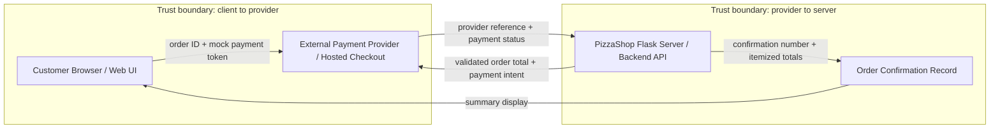

# Sprint 2 Payment Data-Flow Diagram and Trust Boundaries

## Notes

- The browser does not submit the trusted payment amount.
- The server calculates subtotal, ZIP-based tax, and final total before creating the payment intent.
- PizzaShop stores payment status and provider reference only; no card numbers are stored.
- Production deployment must use HTTPS for customer, checkout, payment, and manager/admin traffic.
